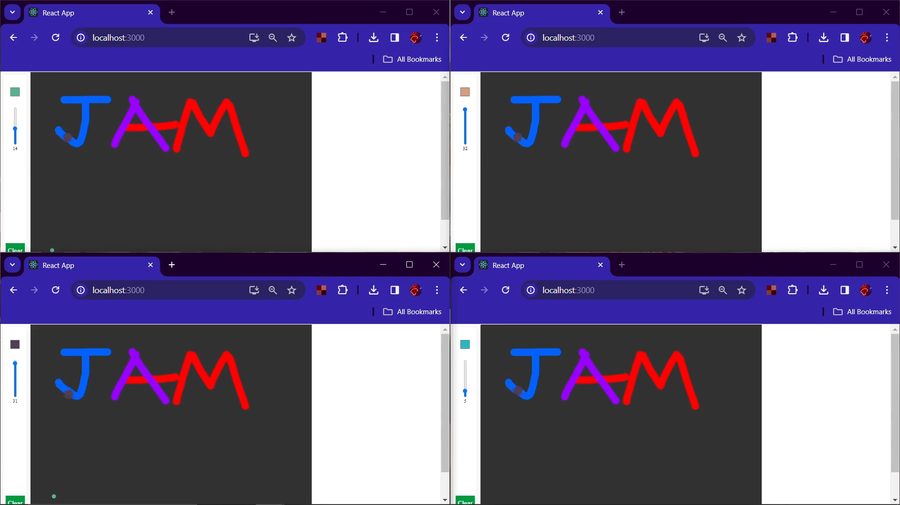

# Jam
Links to the repos reperately:
- (Link to frontend repo: [https://github.com/omkarbhale/jam-backend](https://github.com/omkarbhale/jam-frontend))
- (Link to backend repo: [https://github.com/omkarbhale/jam-backend](https://github.com/omkarbhale/jam-backend))

## Stack used
- React
- [p5.js](https://p5js.org/)
- Socket.io
- MongoDB

## Featues implemented
- Whiteboarding session
- Supports different colors and brush sizes
- Whiteboards are persisted over browser refreshes
- Supports undo/redo
- Collaborators can see others' cursors and drawings in real time
- Ability to save canvas as image

## To do
- Responsiveness
- Authentication

## Demo Video
Youtube link (duration 1:36) [https://youtu.be/EIei-D5-olA](https://youtu.be/EIei-D5-olA) 

## Screenshots

